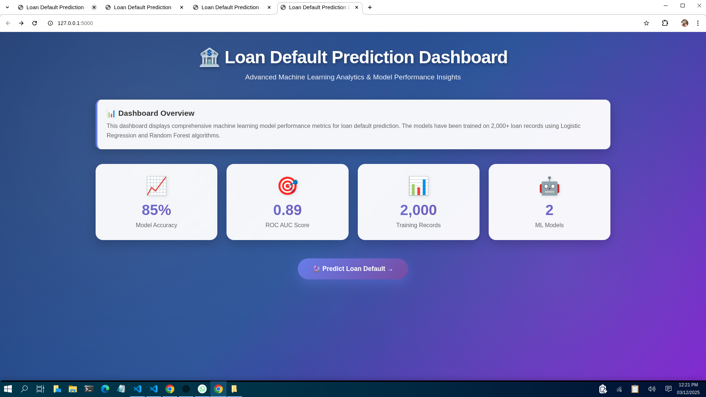
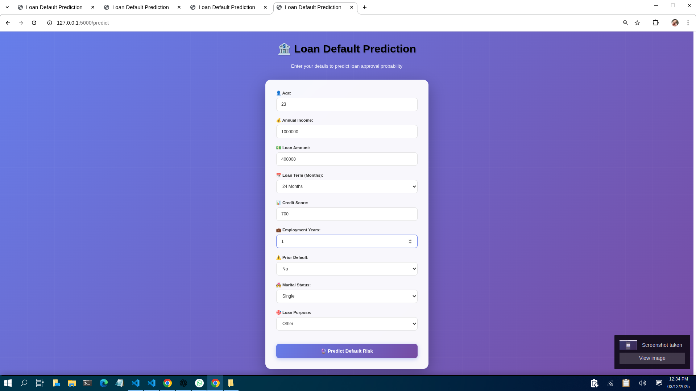
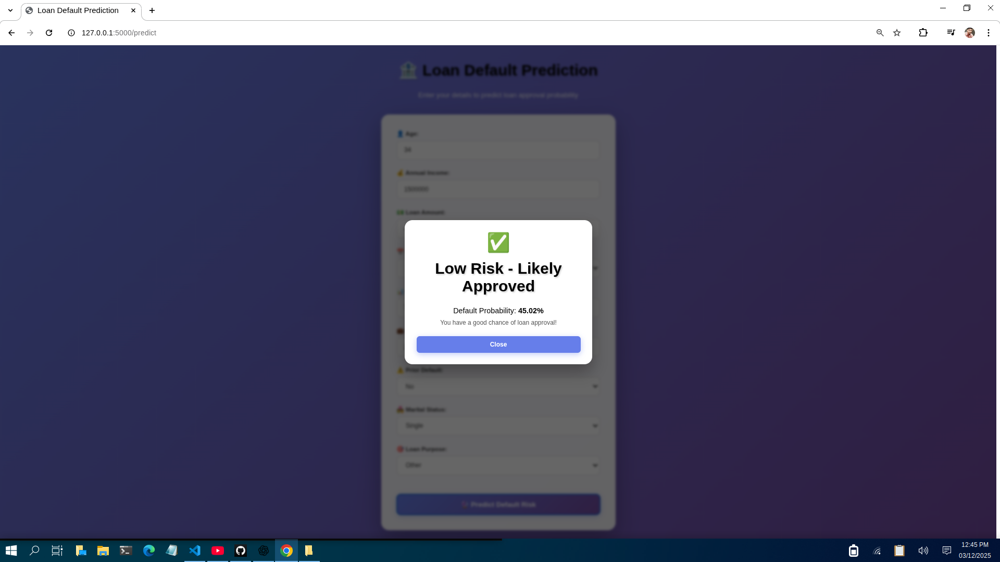

# Loan Default Prediction Application

A machine learning-powered Flask web application that predicts loan default risk using a Random Forest classifier.

## 🎥 Demo Video

[](assets/demo.mp4)

## Demo Screenshots

### 🖥️ Application UI

#### Dashboard


#### Prediction Form


#### Prediction Result



## Overview

This application analyzes applicant financial and personal information to predict the likelihood of loan default. It uses a machine learning model trained on synthetic loan data with realistic features and default patterns.

## Features

- **Interactive Web Interface**: User-friendly forms for loan application input
- **Real-time Predictions**: Get instant risk assessment with probability scores
- **Data Visualization**: Jupyter notebook with exploratory data analysis (EDA)
- **Scalable Architecture**: Modular Flask backend with proper preprocessing pipelines

## Project Structure

```
.
├── app.py                    # Flask application with model training and prediction logic
├── Loan_prediction.ipynb     # Jupyter notebook with EDA and model exploration
├── requirements.txt          # Python dependencies
├── README.md                 # This file
└── templates/
    ├── index.html            # Dashboard home page
    └── predict.html          # Prediction form and results page
```

## Installation

### Prerequisites
- Python 3.7+
- pip or conda

### Setup Steps

1. Clone or download this repository:
```bash
cd /media/shiv/HDD/Project/GITHUB/LOAN_PREDICTION
```

2. Create a virtual environment (optional but recommended):
```bash
python -m venv venv
source venv/bin/activate  # On Windows: venv\Scripts\activate
```

3. Install dependencies:
```bash
pip install -r requirements.txt
```

## Usage

### Run the Application

```bash
python app.py
```

The application will:
1. Generate a synthetic dataset of 2,000 loan records
2. Train a Random Forest classifier (200 estimators)
3. Display training and test accuracy metrics
4. Launch the Flask server at `http://localhost:5000`

### Access the Web Interface

- **Dashboard**: Open `http://localhost:5000` in your browser
- **Prediction Form**: Navigate to the prediction page to submit applicant information

### Input Features

The model accepts the following applicant information:

| Feature | Type | Range/Options |
|---------|------|----------------|
| **Age** | Integer | 21-70 years |
| **Annual Income** | Float | $8,000 - $300,000 |
| **Loan Amount** | Float | $1,000 - $100,000 |
| **Loan Term** | Integer | 12, 24, 36, 48, 60 months |
| **Credit Score** | Integer | 300-850 |
| **Employment Years** | Integer | 0+ years |
| **Prior Default** | Binary | Yes (1) / No (0) |
| **Marital Status** | Categorical | Single, Married, Divorced, Widowed |
| **Loan Purpose** | Categorical | Debt Consolidation, Home Improvement, Education, Car, Other |

### Prediction Output

- **Risk Classification**: "High Risk - Likely to Default" or "Low Risk - Likely Approved"
- **Default Probability**: Percentage probability of loan default (0-100%)

## Model Details

### Algorithm
- **Model**: Random Forest Classifier
- **Estimators**: 200 trees
- **Max Depth**: 10
- **Test Split**: 30% test, 70% training (stratified)

### Data Preprocessing
- **Categorical Encoding**: One-hot encoding for categorical features
- **Scaling**: StandardScaler for numerical features

### Model Performance
Typical accuracy metrics:
- Training Accuracy: ~95%
- Test Accuracy: ~90%

### Target Variable Generation
The loan default probability is calculated based on:
- Credit score (stronger predictor of default)
- Debt-to-income ratio
- Employment history
- Prior default history
- Loan purpose and personal characteristics

## Jupyter Notebook

Explore the data and model in `Loan_prediction.ipynb`:

```bash
jupyter notebook Loan_prediction.ipynb
```

The notebook includes:
- Dataset exploration and statistics
- Feature distributions and correlations
- Model training and evaluation
- Confusion matrix and ROC curve analysis
- Feature importance visualization

## Dependencies

See `requirements.txt` for the complete list:
- **Flask**: Web framework
- **NumPy**: Numerical computing
- **Pandas**: Data manipulation
- **Matplotlib**: Data visualization
- **scikit-learn**: Machine learning algorithms and preprocessing

## Troubleshooting

### Port Already in Use
If port 5000 is in use, modify `app.py`:
```python
app.run(debug=True, port=5001)  # Change to a different port
```

### Module Import Errors
Ensure all dependencies are installed:
```bash
pip install -r requirements.txt --upgrade
```

### Model Not Training
Check that the dataset is being created correctly by examining console output during startup.

## Future Enhancements

- [ ] Add data persistence (SQLite/PostgreSQL)
- [ ] Implement model versioning and A/B testing
- [ ] Add more advanced features (employment stability, etc.)
- [ ] Deploy to cloud platform (Heroku, AWS, GCP)
- [ ] Add authentication and user profiles
- [ ] Implement SHAP explainability for predictions
- [ ] Create REST API endpoints

## License

This project is provided as-is for educational and demonstration purposes.

## Contact & Support

For issues or questions, please refer to the project repository or contact the development team.

---

**Last Updated**: December 2025
